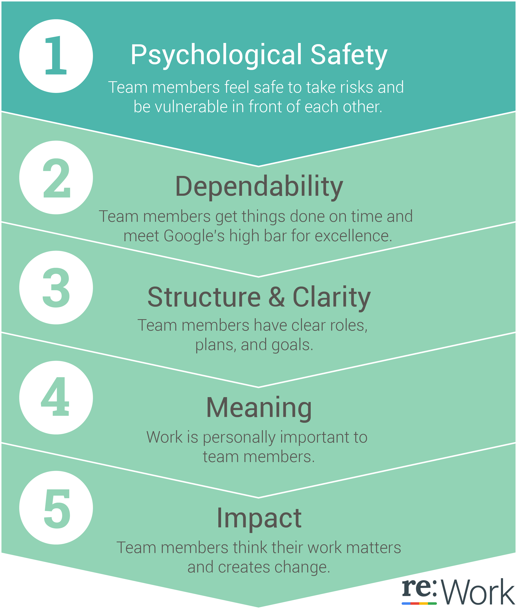
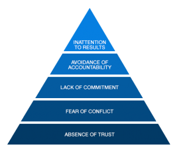
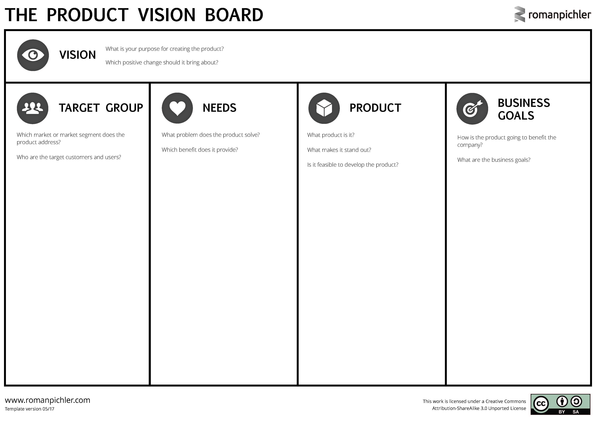

# Globally Distributed Software Engineering

## Module 1 

### Intro
Software engineering distributed over the world (at least two location and continents)

Adding distance in software engineering leads to negative impact: 
1) communication
2) coordination
3) control

Types of Distance: 
- Geographical (KM or time required to travel)
- Temporal (timezone-distance or % overlapping hours)
- Language (Language distance, native vs non-native)
- Cultural ( different cultures at different places)

GDSE involves : Distributed, technological support, globalization, cross-cultural, virtual teams

### Why GDSE

- Access to **scarce resource** and **expertise**
- Faster and round-the-clock development
- Lower development cost
- Low Geographical distance to customers
- History (merge and acquisitions)

#### Centrifugal forces of GDSE :
- Cultural differences
- Loss of "teamness"
- Geographical dispersion 
- Coordination breakdown
- Loss of communication richness

** These forces lead to a lot of rework. **

#### Centripetal forces of GDSE (forces that help tackling centrifugal forces):
- Managerial techniques
- Product architecture
- Telecomm infrastructure
- collaborative technology
- Team building practices
- Development methodology (agile, scrum)

** Paradox of GDSE ** : We need more coordination but we keep adding more location which makes it even harder to coordinate

### Cultural Differences

Six dimensions to measure cultural differences :
- Power Distance Index (PDI) (high PDI leads to simply following orders)
- Individualism (IDV) (Lower IDV look towards larger groups)
- Masculinity (MAS) (high MAS leads to conflicts)
- Uncertainty Avoidance Index (UAI) (Low UAI means more risk-taking)
- Long-Term Orientation (LTO) (High LTO are cultures who think of long-term)
- Indulgence (IND) (High IND are cultures which allows enjoying oneself more)

GDSE Research Areas: 

** Out of sight, out of mind **

Quest for GDSE: creating the virtual 50 meters

1) Discover Best-practices for GDSE
2) Technological support for successful GDSE
3) Distributes agile development
4) Follow-the-sun software development (work follows wherever the sun is shining/ The GDSE stress-testing)
5) Teaching GDSE dynamics 

 * ICGSE conference for GDSE research *

### GDSE at Exact :
1) Team and people availability 
2) Scrum helps in frequent contact (Don't rely on written communication)
3) product vision should be clear to everyone and define a product strategy (product-customer knowledge)

People Factors: 
1) people need to know each other : e.g cultural awareness, be nice and professional, Rhythm and transparency.

## Module 2

Agile in GDSE.

### Lean
Toyota production system = Lean

Lean in a nutshell :
1) respect for people (craftmanship)
2) Flow (Just in Time, Pull)
3) Continuous improvement

### Scrum

### Agile Manifesto

- **Individuals** and **interactions** over processes and tools
- Working software over comprehensive documentation
- Customer collaboration over contract negotiation
- Responding to change over following a plan

### scaling Agile
- SAFe: Scaled Agile Framework
- Scrum of Scrums
- Enterprise Scrum
- Nexus
- Less
If you have multiple scrum teams they need to **Synchroize** them timely. (To show a product as a whole). Chop the job chunk to fit into 3 months cycle for the teams.

### Distributed Scrum and Scrum Values

*Example* : get the team together to get them to agree on how they are going to work together. Then distribute them and work with video conferencing.

**Constant Communication** is key for the distributed scrum.
- Get everybody in the same room time to time
- Using video communication is important in scrum.
- Minimize email, use slack for asynchronous information.
- Regularly Swarm via video (just to talk)
- Tools and techniques should be the same in all locations

#### Discussion
-Scrum meetings are goal bound and time-boxed.
- scrum enforces role clarity and coordination responsibility on the team
- It has two backlogs : 1) product backlog (all the possibilities and future work) 2) sprint backlog (what we will do now for teams)

- agile enforces to get control of the product (working product)

## Module 3

## Automation in GDSE (CI/CD)

(Prajeeth Pradhap)
### why automation in distributed teams?

- Repeated **Human error** in process technology delivery
- Different **locations** and **cultures**
- Automation makes processes **run faster**
- Automation is about **communicating** very precisely with others about how the task or process should be executed.

### Automate the Infrastructures
- **stable** and **consistent** infrastructure across **different locations**
- Everyone works with same **same standards**
- Eliminate **location silo's**
- Effective **knowledge sharing** 
- reduces manual dependencies on other processes like build,test, release. Also, brings endurance in team policies and practices

### Challenges for distributed teams
- **Onboarding a new team member** to the team
- setting up the right **infrastructure**
- Giving **permissions**
- Understanding **quality guidelines** and **practices**

Automation scales all of the above problems with capabilities of **disaster recovery**.

### Do's and Dont's of Automation
1) A separate siloed automation team
- Don't create **separate** siloed automation team
- The main goal of automation is to **break silo's**
- Automation removes the **barriers** between coding, release and testing
- Silo's lead to the **blame-game**

2) Automation is a team responsibility
- Don't make decisions in one part of the team and assign the work to another part of the team. (creates differences. solve by travelling and discussing )
- create **work-sharing**
- stable **CI builders**
- create a **common understanding** of the team practices 

3) Configuration Drift
- The phenomenon where the system and infrastructure become more and more different as time goes on
- Happens due to making manually adopted changes
- A **configuration tool** can help (keeps check on the desired state of infrastructure)

4) Look at non-automation as technical debt
- Sometimes you need to create a **quick and dirty** fix
- Considered these as **technical debt**
- Push them on **backlog** for proper fixing

5) Treat the automation code as production code
- Maintain the same quality checks and standards as for production code
- prevent from technical debt
- Risk: teams will **loose interest** for automation

### Working Experience : Prajeesh Pradhap
- **Communication** is most important
- tools : GitHub, Trello, Slack etc
- overlapping hours help 
- avoid low bandwidth communication (email,doc)
- follow agile and ensure software quality

(Erik Ammerlaan)
### What is Continuous Delivery
- pipeline : code commit,build,unit tests, integration tests, acceptance tests (end to end test), deployment to production (automatic in CD)

- The whole point of CI/CD is to reach to customer faster
- What we think users want is not always what users really want.So, we end up building the wrong things.

- CD keeps an application in **releasable state** and automation reduces **people dependencies**

- CD is all about **communication** . CD enables visibility and context (quick feedback to developers)

### Continuous Delivery at Exact
- use GitHub enterprise with Jenkins (for CI/CD). Then Jenkins builds on Docker container which is monitored by black duck hub (libraries and licences) and SonarQube. Then use Octopus deploy to deploy to production(or staging).

- Docker containers are launched on the fly : **Isolation, reliability and automation **
- More efficient use of hardware : **Elasticity**

### Tips and tricks
- Start with CD as soon as possible
- Avoid randomly broken builds : Builds should only fail if the software is incorrect.
- Avoid False negatives (Software is actually broken,accept mistakes will happen and learn)
- Script everything : use pipeline as code, containerize your build agents
- Use CI on branches for short feedback loops : this gives early feedback to the dev

### Interview (Erik Ammerlaan)

## Module  4

## Boardroom 

### Distributed Leadership (Suzanne Kelder)

#### Outsourcing from a decision-making perspective
1) why outsourcing?
  - cost
  - Quality
  - Focus on what you really need to do
  
2) What is supposed to be outsourced? -> draw a plan or working agreement
  - context
  - What are the boundaries
  - what works? what not?
  - growth-path or not?
  - Alone or together with a vendor?

3) How to manage outsourcing? -> From plan to reality
  - How am I going to manage this?
  - Which KPI's do I want to steer on
  - Penalties and rewards
  - Make the plan work for you, instead of against you
  
 
  Basically, go through the vendor selection process
  
  4) Make a transformation plan for your organisation
    - Transition Phase (cost? time?)
    - Transformation Phase (Internally but how?)
   
   Plan upfront (before outsourcing) what to do if things go wrong. 
   
  5) Legal Aspects
    - data (allowed to leave EU? )
    
 steer the vendor but don't micromanage it.
 
 
 
 #### Do's and Dont's of Outsourcing

- Invest in personnel relationships (get to know vendors personally, corporate and operational people both)
- Give and take and create a win-win plan (don't take all the credits. Don't squeeze too hard/ put pressure)
- Be  honest and transparent and fact-based
- Do not blame each other

#### Pitfalls

- Distributed agile -> Don't have people for a too long period onshore (together only for kick-off). How to mix offshore and onshore?  -> work harder on team aspects

- The highest impact is to be found on an operational level. Keep eye on the operational level to know the difficulties faced at that level. transformation should be workable on the operational level.
- The Dashboard is green but success is not there -> wrong KPI's

- Transformation phase : starts deviating from your original goals. So don't delay transformation

#### Interview : Suzanne Kelder
- GDSE in future for quality than cost

### Top-5 lessons learned for selecting a near or offshore vendor (Svenja de Vos)

1) Check Agile (SCRUM/lean) competence.
2) Find a company that is willing to invest in agile, automation,tooling and especially culture and people
3) Pick the right size company -> pick company suitable to your company size
4) Don't judge only on price -> loo at possibilities, culture fit, competence (also skill and keeping people)
5) Site visits are a must do. (talk to employees and ask questions)

#### Top-4 lessons learnt from practice for GDSE
1) Start with mixed (onshore and offshore) teams in an agile setup.
2) Use only partners no vendors. (make sure you get in partnership contract)
3) It's a people business. Very important to be in contact with people.
4) Don't think that you don't need to manage. Manage output and freedom

#### GSE and physical components
1) Embrace the facts. (embrace hardware limitation)
2) Automation is key. make automation investment upfront.
3) Cooperation and collaboration. Keep everyone aligned and updated

#### Interview : Svejna de Vos

## Module 5

### Offshoring and cost savings (Darja Smite)
- In 90% of offshoring cases it's all about costs

- Cost saving achieved
  - Relatively simple, basic projects
  - Well-defined deliverables that require little management
  - Individual processes, such as test automation
  - Occasionally complex development tasks can yield successful results and decrease costs

- Cost savings not achieved
  - Complex projects
  - projects that require great expertise, domain specific or highly technical projects
  - Follow-the-sun development was quite unsuccessful
  
### Why Cost savings are not achieved ? 
- Costs of selecting a vendor
- costs of managing the contract
- Contracted-based personal cost

 **Hidden Costs**
 - underestimated Travel costs
 - knowledge transfer costs
 - ramp-up costs
 - costs of layoffs
 - retaining costs
 - cotrol costs
 - Extra documentation and more detailed design/specification costs
 - Costs of mentoring and support
 - Costs associated with low productivity
 
 ### Bottomline cost of offshoring in "SwedCo" 
 ### Good reasons to engage in offshoring
 - Offload non-core functions
 - Get access to specialized skill
 - Get access to a specific market
 - customize products to a specific market
 - Establish long-term, strategic relationship with world-class service providers to gain a competitive edge
 - Enhance tactical and strategic advantages
 
 ### None of offshoring benefits can be taken for granted
 1) Leveraging time zone effectiveness -> reduced collaborative time window
 2) Access to large skilled labour pool -> Extremely high attrition rate, socio-cultural problems
 3) Innovation and sharing best practice -> Fear and distrust make developers reluctant to share more than necessary.
 4) Closer proximity to market and customer -> cultural problems
 
 Not all projects are suitable for offshoring
 
 ### SwedCo Case Study
 - Problematic cases for offshoring
  1) Large scale distributed software development
  2) software is complex and is legacy system
  
  1 hour development costs in India 25% of Sweden
  
  extra cost per employee:
  - Knowledge transfer
  - travel relocation
  - mentoring and support
  
  others : cost of process documentation, admin. cost, cost of quality control, rescue cost, extra hardware cost.
  
A new and immature team is less productive compared to an experienced team. The new team takes time to learn (1 or 2 years), this cost is not taken into consideration by companies.

**High Attrition** rate has an impact on productivity and learning rate.

**Long learning curve** along with high attrition rate is a deadly combination.
 
 ### Lecture by David Redmiles

#### Challenges in Globally Distributed world
- Isolation prevents knowing what others are doing
- Lack of awareness also prevents knowing why they are doing or not doing something
- Distance prevents familiarity both professional and personal

#### Enhance awareness
- how do people know **to whom** they should display actions and whose action should they monitor?
- The **awareness network** is the set of actors whose actions need to be monitored and those to whom one needs to make one's own action visible.

There are a lot of ad-hoc tools and work going on to make work more visible. A software tool to visualize who's doing what helps.

- Personal chat or cheap chat (not work related) can help in building trust and better cooperation.

- Drawing at work experiment : Dividing teams to draw a drawing, for some teams a particular drawing and for other teams freestyle drawing. Overall there was a positive effect on team and cohesion. However, in the case of freestyle drawing, positive effect and cohesion improved. 

Enhancing the technical side by **Maintaining and enhancing** the personal dimension is important.
 
## Module 6

Time and culture differences in GDSE (By Dianne Elsinga)

### Culture in Global Software Engineering

Team members in Netherlands and Bangalore

- A leader sets up ways to connect and align team members with each other

How to deal with culture difference teams?
- Use Culture Map (by Erin Meyer) and do culture training 
- Consciously deal with lowering the social and emotional differences
- Trust and Safety grow if there is awareness and understanding on both sides

### Building a great globally distributed team
- Kick off : get to know each other activities personally and professionally (define greatness)
- do cultural awareness by creating culture map
- Team Vision(why) : is a sentence that inspires the whole team every day
  (Use the golden circle of Simon Sinek: Why,How, what?)
- Team Values(how) : Use leader intervention to avoid Lencioni's team dysfunctions
- Team Working Agreements and Manifesto: (methods of collaboration,meeting etc)
Day 2
- Product Definition (using product vision board of Roman Pichler) to help think and figure out benefits. Also define the Minimum viable product with stakeholder(customers,product owners etc)

### High performing Global Teams
Team = Product
- Technology is the base of HP team (level 0)
- Aligned team : create clarity, agreements and collaboration over distance (level 1) (Daily standup meetings help)
- Engaged Team : Fostering of trust and openness,cultural awareness (Level 2)
- Cross-functional team: attain all required skills to deliver a releasable increment every sprint (Level 3) (Guild meetings can help)
- Self-Steering Team: Team has ownership of the work process, progress and results. self driven and highly motivated teams.(Level 4)
- High Performing Team: The team is completely attuned, "Power of Ba",knows the impact of work

### Working Across Time Zones By Erran Carmel
- 4 time zones in the USA
- One in China
- Ten time Zones in Russia(earlier 11)

Biggest hurdle caused by temporal distance
- When we need to do the complex task there is a need to converge (interact in real time)
Types of complex task : (1) Creativity, ideas 2) Disagreement

Three terms :
- Nomadism: work from any geographic location
- Scatter time : spread out your work across the workday
- Timeshifting : adjust wok hours to overlap time 

## Module 7

GDSE locations: Near-shoring and Offshoring
###  Daily life of a Distributed Software Engineer - Maran Gunasekaran
- start with coffee/tea and greet team-mates
- pickup writing code from where it was brought to a logical end
- Gather for the Daily Scrum meeting to synchronize plans for the day and measure progress
- If iteration planning day : start planning the work for an iteration
  if iteration end : showcase the business value being delivered and seek feedback from business owners and stakeholders.
- Calls with business owners, use of tons of bandwidth
- start next iterations planning meeting on the last day of the previous iteration

### Tools for distributed software engineer

tools for work or backlog management 9managing iterations , bug tracking and features):
Jira, Trello, Agile Cockpit, Version one

Chatroom and video conferencing:
Slack, Skype for Business, Microsoft Teams, appear.in, Bluejeans, interactive whiteboards, TeamViewer

Knowledge sharing and collaboration: 
internal wiki pages, confluence, Microsoft SharePoint

tools SCM :
Bitbucket,GitHub, Visual Studio Online, Jenkins, Travis, JFrog artifactory

Tools : Hardware
 - Video conferencing camera with a panoramic/360 view
 - Flat TV screens at least 50 inches with camera mount
 - Developer machines with camera, headphones and mic
 
 
 ### Do's and Dont's for Distributed software engineers
 - Share holiday calendars and leave plans
 - Make tiny check-ins of code multiple times a day or at the very least during the end of the day
 - Meet face to face as much as possible
 - Organize tech talks between distributed teams
 - Maintain transparency with the business owners
 
 Dont's
 - Don't wait for email responses
 - Don't context switch and let others context switch either
 - Don't do it all alone
 - Don't let distance determine whether to give critical feedback or not
 - Don't be subjective
 
 
 ## Developments in Country Selection - Paul Tija
 
is country selection important?
- Not important in case of small and low-risk projects
- very important in case of own subsidiary
- geopolitical considerations
Important factors : wages and costs, the industry, quality of life, infrastructure, Human Capital, capital, Government vision and policy, Linkages

### India and Bangladesh
India Disadvantages: 
-accent, distance, time difference, rising tariffs, cultural differences, High turn over rate of staff

Hence we see nearshoring growing for small-medium size companies

### Palestine and North Korea

Palestine has an additional advantage: it can give access to the Gulf markets (localization of software)
- can also boost CSR

North-Korea is cheapest in Asia for outsourcing and IT skills are good
